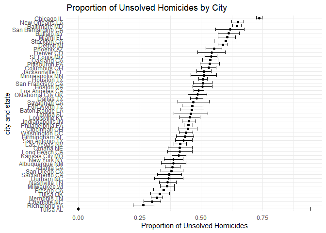
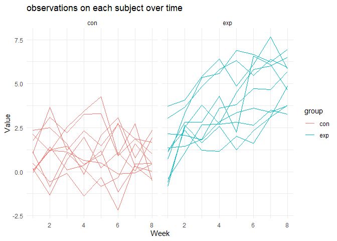

p8105_hw5_cp3384
================
Chenshuo Pan
2023-11-02

# Question1

``` r
homicide_data <- read.csv("data/homicide-data.csv")
```

**Describe the raw data. Create a city_state variable (e.g. “Baltimore,
MD”) and then summarize within cities to obtain the total number of
homicides and the number of unsolved homicides (those for which the
disposition is “Closed without arrest” or “Open/No arrest”).**

``` r
city_state_summary<- homicide_data%>%
#Use string checks and case_when to calculate the status variable based on the scenario
  mutate(status = case_when(
    str_detect(disposition,"No") ==TRUE ~"unsolved homicides ",
    str_detect(disposition,"without") ==TRUE~"unsolved homicides ",
    TRUE   ~ "homicides "
  ))%>%
  mutate(city_state  = paste(city,state))%>%
  group_by(city_state)%>%
#Calculate the proportion of unsolved homicides
  summarise(unhomicides = sum(status == "unsolved homicides "),n = n())
```

The `homicide_data` contains 52179 observations and 12 variables, the
key variables are: uid, reported_date, victim_last, victim_first,
victim_race, victim_age, victim_sex, city, state, lat, lon, disposition

**For the city of Baltimore, MD, use the prop.test function to estimate
the proportion of homicides that are unsolved; save the output of
prop.test as an R object, apply the broom::tidy to this object and pull
the estimated proportion and confidence intervals from the resulting
tidy dataframe.**

``` r
#Select area as Baltimore
md <- city_state_summary %>%
  filter(city_state == "Baltimore MD")
# pull values out
unhomicides <- pull(md,unhomicides)
n <- pull(md,n)

#Do prop test
md_test <- prop.test(unhomicides,n)

prop_test<-broom::tidy(md_test)
# create a dataframe to show the tidy table
data.frame(city = "Baltimore MD",
          proportion = pull(prop_test,estimate),
          confidence_interval = paste("[",pull(prop_test,conf.low),
                                      pull(prop_test,conf.high),"]"))
```

    ##           city proportion                     confidence_interval
    ## p Baltimore MD  0.6455607 [ 0.627562457662644 0.663159860401662 ]

**Now run prop.test for each of the cities in your dataset, and extract
both the proportion of unsolved homicides and the confidence interval
for each. Do this within a “tidy” pipeline, making use of purrr::map,
purrr::map2, list columns and unnest as necessary to create a tidy
dataframe with estimated proportions and CIs for each city.**

``` r
# run prop.test for each of the cities
all_city_state<-city_state_summary%>%
# do prop test for each row
  mutate(test = map2(unhomicides,n,~prop.test(.x,.y)))%>%
  mutate(tidy = map(test,broom::tidy))%>%
  unnest(tidy)%>%
# mutate confidence interval variable
  mutate(confidence = paste("[",conf.low,conf.high,"]"))%>%
  select(city_state,estimate,conf.low,conf.high,confidence)
```

    ## Warning: There was 1 warning in `mutate()`.
    ## ℹ In argument: `test = map2(unhomicides, n, ~prop.test(.x, .y))`.
    ## Caused by warning in `prop.test()`:
    ## ! Chi-squared approximation may be incorrect

``` r
all_city_state
```

    ## # A tibble: 51 × 5
    ##    city_state     estimate conf.low conf.high confidence                        
    ##    <chr>             <dbl>    <dbl>     <dbl> <chr>                             
    ##  1 Albuquerque NM    0.386    0.337     0.438 [ 0.337260384254284 0.43757660655…
    ##  2 Atlanta GA        0.383    0.353     0.415 [ 0.352811897036302 0.41482188395…
    ##  3 Baltimore MD      0.646    0.628     0.663 [ 0.627562457662644 0.66315986040…
    ##  4 Baton Rouge LA    0.462    0.414     0.511 [ 0.414198741860307 0.51102396001…
    ##  5 Birmingham AL     0.434    0.399     0.469 [ 0.399188948632167 0.46895574818…
    ##  6 Boston MA         0.505    0.465     0.545 [ 0.464621930200304 0.54508805177…
    ##  7 Buffalo NY        0.612    0.569     0.654 [ 0.568798964634228 0.65408793925…
    ##  8 Charlotte NC      0.300    0.266     0.336 [ 0.26608198188312 0.335899860867…
    ##  9 Chicago IL        0.736    0.724     0.747 [ 0.723995888425454 0.74739978730…
    ## 10 Cincinnati OH     0.445    0.408     0.483 [ 0.407960574220688 0.48314388061…
    ## # ℹ 41 more rows

**Create a plot that shows the estimates and CIs for each city – check
out geom_errorbar for a way to add error bars based on the upper and
lower limits. Organize cities according to the proportion of unsolved
homicides.**

``` r
#shows the estimates and CIs for each city
ggplot(all_city_state,aes(y = reorder(city_state, estimate) ,x = estimate))+
  geom_point() +
  geom_errorbar(aes(xmin = conf.low,xmax = conf.high))+
  labs(x = "Proportion of Unsolved Homicides", y = "city and state", title = "Proportion of Unsolved Homicides by City") +
  theme_minimal()
```

<!-- -->

I sorted by the average proportion of each city-state. It can be seen
that the highest Proportion of Unsolved Homicides is Chicago and the
lowest is Tulsa, AL.

# Question2

**Create a tidy dataframe containing data from all participants,
including the subject ID, arm, and observations over time**

``` r
#read vsv file first , using list files and map() to read all csv in the path
#then unnest
longitudinal <- data.frame(file_name = paste("./data/",list.files(path = "./data",pattern = "[0-9].csv",),sep = ""))%>%
  mutate(x = map(file_name,read_csv))%>%
  unnest(x)%>%
#Use string sub to keep the key information
  mutate(ID = str_sub(file_name,12,13),
         group = str_sub(file_name,8,10))%>%
  select(-file_name)%>%
  relocate(group,ID)%>%
#make a long table to make sure weekly observations are “tidy”,
  pivot_longer(week_1:week_8,values_to = "value",names_to = "week")%>%
  mutate(week = str_sub(week,-1,-1),
         week = as.numeric(week))

longitudinal
```

    ## # A tibble: 160 × 4
    ##    group ID     week value
    ##    <chr> <chr> <dbl> <dbl>
    ##  1 con   01        1  0.2 
    ##  2 con   01        2 -1.31
    ##  3 con   01        3  0.66
    ##  4 con   01        4  1.96
    ##  5 con   01        5  0.23
    ##  6 con   01        6  1.09
    ##  7 con   01        7  0.05
    ##  8 con   01        8  1.94
    ##  9 con   02        1  1.13
    ## 10 con   02        2 -0.88
    ## # ℹ 150 more rows

**Make a spaghetti plot showing observations on each subject over time,
and comment on differences between groups.**

``` r
#showing observations on each subject over time
longitudinal%>%
  ggplot(aes(x = week, y = value,group = ID, color = group))+
  geom_line()+
#plot according to groups
  facet_grid(~group)+
  labs(x = "Week", y = "Value", title = "observations on each subject over time") +
  theme_minimal()
```

<!-- -->

Comment: Comparing the control group and the experimental group, we can
see that among the ten sets of data in the control group, the Value only
fluctuates up and down with the week, and there is no clear trend. In
the experimental group, almost all IDs showed positive correlation,
which means that as Week increases, Value also increases.

# Question 3

**First set the following design elements:**

**Fix n=30** **Fix σ=5** **Set μ=0. Generate 5000 datasets from the
model**

**x∼Normal\[μ,σ\]**

**For each dataset, save μ^ and the p-value arising from a test of H:μ=0
using α=0.05. Hint: to obtain the estimate and p-value, use broom::tidy
to clean the output of t.test.**

``` r
n = 30
sigma = 5
set.seed(123)
mu =0

# This is the function calculating p_value and mu hat for each sample we generated. 

sample_t = function(n = 30, mu = 0, sigma = 5) {
#simulation  
  sim_data = tibble(
    x = rnorm(n, mean = mu, sd = sigma),
  )
# do t test  
  test_result <- t.test(pull(sim_data,x), mu = 0)
  tidy_test_result <- broom::tidy(test_result)
  
  results <- tibble(mu_hat = pull(tidy_test_result,estimate),p.value = pull(tidy_test_result,p.value))
  
  return(results)
}

# This is the function to simulate the sample_t 5000times and calculate the proportion of reject cases
simulation = function(mu){
  
  output = vector("list", 5000)
# do sample_t 5000 times
  for(i in 1:5000){
    output[[i]] = sample_t(30,mu = mu,5)
  }
  
  sim_out = bind_rows(output)

# fo two-sided t test and create a table contains all information we need  
  proportion = sim_out%>%
    mutate(reject = ifelse(p.value < 0.025 | p.value > 0.975, 1, 0))%>%
    summarise(prop = sum(reject)/5000,
              muhat = mean(mu_hat),
              null_muhat = mean(mu_hat[reject==1]))
  
  

  return(proportion)
}

# return table for mu =0
simulation(mu = 0)
```

    ## # A tibble: 1 × 3
    ##     prop   muhat null_muhat
    ##    <dbl>   <dbl>      <dbl>
    ## 1 0.0446 0.00900     0.0785

**Repeat the above for $\mu$={1,2,3,4,5,6}, and complete the
following:** I combine $\mu = 0$ with the rest (1-6)

``` r
sim_output = data.frame(mu = numeric(7), proportion= numeric(7),mu_hat= numeric(7),null= numeric(7))
# repeat for mu = 0-6
for (i in 0:6) {
  a = simulation(mu = i)
  sim_output[i,"mu"] = i
  sim_output[i,"proportion"] = a[1,"prop"]
  sim_output[i,"mu_hat"] = a[1,"muhat"]
  sim_output[i,"null"] = a[1,"null_muhat"]
}
```

**Make a plot showing the proportion of times the null was rejected (the
power of the test) on the y axis and the true value of $\mu$ on the x
axis. Describe the association between effect size and power.**

``` r
#showing the proportion of times the null was rejected 
ggplot(sim_output,aes(x = mu , y =proportion))+
  geom_line()+
  geom_point() +
  labs(x = "true value of mu", y = "proportion of rejection", title = "Rejection proportion corresponding to different mu") +
  scale_x_continuous(breaks = seq(0, 6, 1)) +
  theme_minimal()
```

<!-- -->

Comment: As can be seen from the figure above, for the test H:μ = 0: as
the true average value used by our simulated data increases, the
proportion of rejecting the null hypothesis increases. When the real mu
value is 5 or greater, We will almost reject H:μ = 0 for all the
generated random data.

**Make a plot showing the average estimate of $\mu$^ on the y axis and
the true value of $\mu$ on the x axis. Make a second plot (or overlay on
the first) the average estimate of $\mu$^ only in samples for which the
null was rejected on the y axis and the true value of $\mu$ on the x
axis. Is the sample average of $\mu$^ across tests for which the null is
rejected approximately equal to the true value of μ? Why or why not?**

``` r
#showing the average estimate of mu and the true mu
ggplot(sim_output,aes(x = mu , y =mu_hat))+
  geom_line() +
  geom_point() +
  labs(x = "true value of mu", y = "average estimate of mu hat", title = "Average estimated value versus true value of Mu") +
  scale_x_continuous(breaks = seq(0, 6, 1)) +
  scale_y_continuous(breaks = seq(0, 6, 1))+
  theme_minimal()
```

<!-- -->

Comment: When the number of our simulations is large enough (n=5000) we
can find that the average $\mu_{hat}$ will be very close to the real
$mu$ value, so the image appears as y=x.

``` r
#average estimate of mu only in samples for which the null was rejected and average estimate of mu and the true mu


ggplot(sim_output) +
#plot average estimate of mu
  geom_point(aes(x = mu, y = mu_hat, color = "mu_hat")) +
#plot average estimate of mu only in samples for which the null was rejected
  geom_point(aes(x = mu, y = null, color = "mu_hat for reject part")) +
  geom_line(aes(x = mu, y = mu_hat, color = "mu_hat")) +
  geom_line(aes(x = mu, y = null, color = "mu_hat for reject part")) +
  scale_color_manual(values = c("mu_hat" = "blue", "mu_hat for reject part" = "red")) +
  labs(x = "true value of mu", y = "average estimate of mu hat", title = "Average estimated value and true value of Mu under different conditions") +
  scale_x_continuous(breaks = seq(0, 6, 1)) +
  scale_y_continuous(breaks = seq(0, 6, 1))+
  theme_minimal()
```

<!-- -->

Comments:When $\mu$ is 0 or 4, 5, or 6, the average predicted value is
close to the average predicted value of the rejected hypothesis part,
and both are approximate to the true value. And when $\mu$ is 1,2,3, the
average predicted value of the part that rejects the null hypothesis
will be higher than the average predicted value. The above phenomenon is
because we set H:μ = 0 , and we will reject the hypothesis only when the
predicted value of a sample is significantly greater or less than 0.
Therefore, as the true value mu increases, the average predicted value
and the average predicted value of the rejected hypothesis part will
converge.
